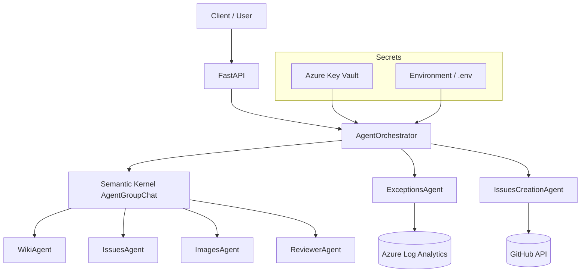
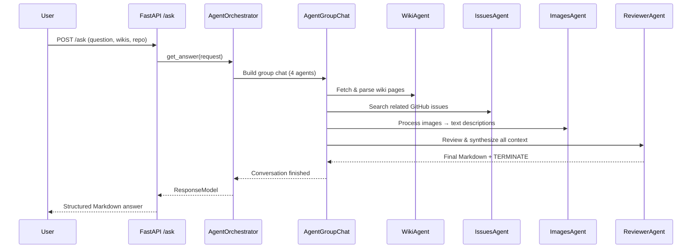
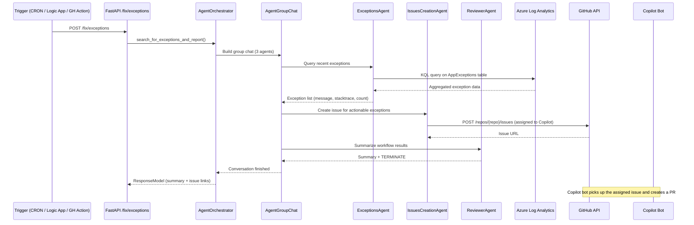

# veta-agents

**AI-powered GitHub bot** that automates issue resolution using FastAPI and Semantic Kernel. Six specialized OpenAI agents collaborate through multi-agent orchestration to answer questions from wiki/issue context and detect production exceptions that become auto-created GitHub issues — assigned to Copilot for autonomous PR creation.

> Runs in **Azure Web App for Containers** with infrastructure managed through Terraform (Azure Verified Modules).

---

## Table of Contents

1. [Architecture Overview](#architecture-overview)
2. [Quick Start](#quick-start)
3. [Configuration](#configuration)
4. [API Endpoints](#api-endpoints)
5. [End-to-End Flows](#end-to-end-flows)
6. [Infrastructure & Deployment](#infrastructure--deployment)
7. [CI/CD](#cicd)
8. [Testing](#testing)
9. [Troubleshooting](#troubleshooting)
10. [Detailed Documentation](#detailed-documentation)
11. [Authors & License](#authors--license)

---

## Architecture Overview

```
┌─────────────────────────────────────────────────────────────────────┐
│                        FastAPI  (app/main.py)                       │
│              InsightsMiddleware  ·  X-API-Key auth                   │
├──────────────┬──────────────────────────────────────────────────────┤
│  POST /ask   │  POST /fix/exceptions                                │
└──────┬───────┴──────────┬───────────────────────────────────────────┘
       │                  │
       ▼                  ▼
┌──────────────────────────────────────────────────────────────┐
│                   AgentOrchestrator                           │
│         (AgentGroupChat + ApprovalTerminationStrategy)        │
├──────────────────────────────────────────────────────────────┤
│                                                              │
│  ┌────────────┐ ┌────────────┐ ┌────────────┐               │
│  │ WikiAgent  │ │IssuesAgent │ │ImagesAgent │  ← /ask flow  │
│  └────────────┘ └────────────┘ └────────────┘               │
│                                                              │
│  ┌────────────────┐ ┌──────────────────────┐                 │
│  │ExceptionsAgent │ │IssuesCreationAgent   │  ← /fix flow   │
│  └───────┬────────┘ └──────────┬───────────┘                 │
│          │                     │                             │
│          ▼                     ▼                             │
│   Azure Log Analytics     GitHub API                         │
│   (KQL: AppExceptions)    (create issue → assign Copilot)    │
│                                                              │
│  ┌───────────────┐                                           │
│  │ ReviewerAgent │  ← both flows (sends TERMINATE)           │
│  └───────────────┘                                           │
└──────────────────────────────────────────────────────────────┘
       │                           │
       ▼                           ▼
  Azure OpenAI              Secrets (env / Key Vault)
  (AzureChatCompletion)     via config_factory
```

### The 6 Agents

| Agent | Used in | Role |
|-------|---------|------|
| **WikiAgent** | `/ask` | Downloads and parses wiki pages to provide contextual answers |
| **IssuesAgent** | `/ask` | Searches existing GitHub issues for related resolutions |
| **ImagesAgent** | `/ask` | Processes images from wiki content into text descriptions |
| **ReviewerAgent** | Both | Synthesizes all agent outputs into a final Markdown response; sends `TERMINATE` to end the conversation loop |
| **ExceptionsAgent** | `/fix/exceptions` | Queries Azure Log Analytics `AppExceptions` table via KQL |
| **IssuesCreationAgent** | `/fix/exceptions` | Creates GitHub issues from detected exceptions and assigns them (e.g., to the Copilot coding agent) |

### Orchestration

Agents run inside an `AgentGroupChat` (Semantic Kernel) with an `ApprovalTerminationStrategy`. The conversation ends when **ReviewerAgent** emits a message containing `TERMINATE` (stripped from the final response). Maximum iterations: 10.



---

## Quick Start

### Prerequisites

- **Python 3.12.10** (exact version required)
- [uv](https://docs.astral.sh/uv/) package manager
- An Azure OpenAI resource with a deployed model (e.g., `gpt-4o`)
- A GitHub personal access token with `repo` scope

### 1. Clone and install

```bash
git clone https://github.com/Veta-agentic/veta-agents.git
cd veta-agents
pip install uv
uv sync
```

Activate the virtual environment:

```bash
# Linux / macOS
source .venv/bin/activate

# Windows
.venv\Scripts\activate
```

### 2. Configure environment

```bash
cp .env.sample .env
# Edit .env with your values (see Configuration section below)
```

### 3. Run the server

```bash
uvicorn app.main:app --reload --env-file .env
```

Open the interactive docs at **http://localhost:8000/docs**.

### 4. Make your first request

```bash
curl -X POST http://localhost:8000/ask \
  -H "Content-Type: application/json" \
  -H "X-API-Key: YOUR_API_KEY" \
  -d '{
    "question": "How do I configure auto-refresh?",
    "githubWikis": ["https://github.com/ORG/REPO/wiki/Setup"],
    "githubWikiBaseImageUrl": "https://github.com/ORG/REPO/wiki/",
    "githubRepo": "ORG/REPO"
  }'
```

### Alternative: Docker

```bash
make build   # docker build -t veta-agents .
make up      # docker run -p 8000:8000 veta-agents
```

---

## Configuration

Configuration loads through `config_factory.py`:

| `ENVIRONMENT` value | Secret loader | How it works |
|---------------------|---------------|--------------|
| `dev` | `EnvSecretLoader` | Reads from environment variables / `.env` file |
| Anything else (default: `prod`) | `KeyVaultSecretLoader` | Reads from Azure Key Vault using managed identity (`DefaultAzureCredential`) |

### `.env.sample` Reference

```env
# ── App ──────────────────────────────────────────
ENVIRONMENT=dev                        # "dev" = env vars, anything else = Key Vault
API_KEYS=my-local-key,another-key      # Comma-separated; checked via X-API-Key header
KEYVAULT_NAME=MyKeyVault               # Required when ENVIRONMENT != dev
APPINSIGHTS_CONNECTION_STRING=          # Optional; enables OpenTelemetry tracing

# ── GitHub ───────────────────────────────────────
GH_TOKEN=ghp_XXXXXXXXXXXXXXXXXXXX      # Scopes: repo (private) or public_repo

# ── Azure OpenAI per agent ───────────────────────
# Each agent needs: deployment name, API key, base URL, API version.
# All four agents can share the same Azure OpenAI resource.
#
# ⚠️  *_BASE_URL must be the resource endpoint ONLY:
#     ✅  https://my-resource.openai.azure.com/
#     ❌  https://my-resource.openai.azure.com/openai/deployments/gpt-4o/chat/completions
#     See "Known Gotchas" in Troubleshooting for details.

IMAGES_DEPLOYMENT_NAME=gpt-4o
IMAGES_API_KEY=xxxxxxxxxxxxxxxxxxxxxxxxxxxxxxxx
IMAGES_BASE_URL=https://YOUR-RESOURCE.openai.azure.com/
IMAGES_API_VERSION=2025-01-01-preview

ISSUES_DEPLOYMENT_NAME=gpt-4o
ISSUES_API_KEY=xxxxxxxxxxxxxxxxxxxxxxxxxxxxxxxx
ISSUES_BASE_URL=https://YOUR-RESOURCE.openai.azure.com/
ISSUES_API_VERSION=2025-01-01-preview

WIKIS_DEPLOYMENT_NAME=gpt-4o
WIKIS_API_KEY=xxxxxxxxxxxxxxxxxxxxxxxxxxxxxxxx
WIKIS_BASE_URL=https://YOUR-RESOURCE.openai.azure.com/
WIKIS_API_VERSION=2025-01-01-preview

REVIEWER_DEPLOYMENT_NAME=gpt-4o
REVIEWER_API_KEY=xxxxxxxxxxxxxxxxxxxxxxxxxxxxxxxx
REVIEWER_BASE_URL=https://YOUR-RESOURCE.openai.azure.com/
REVIEWER_API_VERSION=2025-01-01-preview

# ── Log Analytics (for /fix/exceptions) ──────────
# These can also be passed per-request in the POST body.
AZURE_LA_WORKSPACEID=00000000-0000-0000-0000-000000000000
AZURE_CLIENT_ID=00000000-0000-0000-0000-000000000000
AZURE_TENANT_ID=00000000-0000-0000-0000-000000000000
AZURE_CLIENT_SECRET=xxxxxxxx
```

### Authentication

All routes require an `X-API-Key` header. The value must match one of the comma-separated keys in `API_KEYS`.

```
X-API-Key: my-local-key
```

---

## API Endpoints

### `POST /ask` — Q&A from wiki and issue context

Ask a question and receive a synthesized Markdown answer built from wiki pages, GitHub issues, and image analysis.

**Request body:**

| Field | Type | Required | Description |
|-------|------|----------|-------------|
| `question` | string | Yes | The user's question |
| `githubWikis` | string[] | Yes | Wiki page URLs to use as context |
| `githubWikiBaseImageUrl` | string | Yes | Base URL for resolving wiki images |
| `githubRepo` | string | Yes | GitHub repo (`owner/repo`) for issue search |
| `user` | string | No | User identifier |
| `sessionId` | string | No | Session identifier |
| `historyMessages` | object[] | No | Prior conversation history |

**Example with curl:**

```bash
curl -X POST http://localhost:8000/ask \
  -H "Content-Type: application/json" \
  -H "X-API-Key: my-local-key" \
  -d '{
    "question": "How do I configure the Infrastructure Dashboard?",
    "githubWikis": [
      "https://github.com/Azure/CCOInsights/wiki/Infrastructure-Dashboard",
      "https://github.com/Azure/CCOInsights/wiki/Infrastructure-Dashboard-Deployment%20Guide"
    ],
    "githubWikiBaseImageUrl": "https://github.com/Azure/CCOInsights/wiki/",
    "githubRepo": "azure/ccoinsights"
  }'
```

**Response (`ResponseModel`):**

```json
{
  "answer": "🤖 ## Response\nHere is how to configure...\n## Wiki References\n- [Deployment Guide](https://...)\n## Issues Related\n- [#42 Dashboard config](https://...)",
  "historyMessages": [{"role": "user", "message": "..."}],
  "agentsGroupChat": [
    {"role": "WikiAgent", "message": "..."},
    {"role": "IssuesAgent", "message": "..."},
    {"role": "ImagesAgent", "message": "..."},
    {"role": "ReviewerAgent", "message": "..."}
  ],
  "sources": ["wiki-page-1.md"],
  "suggestions": ["Explore X"],
  "prompt_tokens": "1200",
  "completion_tokens": "450"
}
```

### `POST /fix/exceptions` — Detect exceptions and create GitHub issues

Query Azure Log Analytics for recent exceptions and automatically create GitHub issues for actionable ones.

**Request body:**

| Field | Type | Required | Description |
|-------|------|----------|-------------|
| `azureLogAnalyticsWorkspaceId` | string | Yes | Log Analytics Workspace ID (GUID) |
| `azureClientId` | string | Yes* | Service principal client ID |
| `azureTenantId` | string | Yes* | Azure AD tenant ID |
| `azureClientSecret` | string | Yes* | Service principal secret |
| `githubRepo` | string | Yes | Target repo for issue creation (`owner/repo`) |
| `days` | int | No | Days to look back (default: `1`) |
| `user` | string | No | User identifier |
| `sessionId` | string | No | Session identifier |
| `historyMessages` | object[] | No | Conversation history |

> **Note:** Field names use **camelCase** in requests (via Pydantic alias) and **PascalCase** in serialized responses.

**Example with curl:**

```bash
curl -X POST http://localhost:8000/fix/exceptions \
  -H "Content-Type: application/json" \
  -H "X-API-Key: my-local-key" \
  -d '{
    "azureLogAnalyticsWorkspaceId": "xxxxxxxx-xxxx-xxxx-xxxx-xxxxxxxxxxxx",
    "azureClientId": "xxxxxxxx-xxxx-xxxx-xxxx-xxxxxxxxxxxx",
    "azureTenantId": "xxxxxxxx-xxxx-xxxx-xxxx-xxxxxxxxxxxx",
    "azureClientSecret": "your-client-secret",
    "days": 1,
    "githubRepo": "ORG/REPO"
  }'
```

### Status Codes

| Code | Meaning |
|------|---------|
| `200` | Success — response payload is a `ResponseModel` |
| `401` | Missing or invalid `X-API-Key` |
| `422` | Validation error (FastAPI) |
| `500` | Unexpected server error |

### Other Endpoints

| Endpoint | Method | Description |
|----------|--------|-------------|
| `/docs` | GET | Swagger UI (interactive API explorer) |
| `/openapi.json` | GET | OpenAPI schema (JSON) |

---

## End-to-End Flows

### Q&A Flow (`/ask`)



1. User sends a question with wiki URLs and a target repo.
2. **WikiAgent** downloads and parses the wiki pages.
3. **IssuesAgent** searches the repo for related issues.
4. **ImagesAgent** extracts and describes images found in wiki content.
5. **ReviewerAgent** combines everything into a Markdown answer with three sections: *Response*, *Wiki References*, and *Issues Related*. It appends `TERMINATE` to end the loop.

### Exception Detection Flow (`/fix/exceptions`)



1. An external trigger (CRON job, Azure Logic App, or GitHub Action) calls `POST /fix/exceptions`.
2. **ExceptionsAgent** queries the Log Analytics `AppExceptions` table via KQL for recent errors.
3. **IssuesCreationAgent** creates a GitHub issue for each actionable exception and assigns it to the Copilot coding agent.
4. **ReviewerAgent** synthesizes a summary of all actions taken.
5. The **Copilot bot** autonomously picks up the assigned issue and creates a PR to fix it.

---

## Infrastructure & Deployment

Infrastructure is defined in `iac/TF/` using **Azure Verified Modules (AVM)** and Terraform.

### Azure Resources Provisioned

| AVM Module | Resource | Purpose |
|------------|----------|---------|
| `azurerm_resource_group` | Resource Group | Container for all resources |
| `avm-res-keyvault-vault` | Key Vault | Secrets storage (RBAC mode) |
| `avm-res-web-serverfarm` | App Service Plan | Linux hosting plan |
| `avm-res-web-site` | Web App for Containers | Runs the FastAPI container |
| `avm-res-containerregistry-registry` | Container Registry (ACR) | Private Docker image registry |
| `avm-res-operationalinsights-workspace` | Log Analytics | Centralized logging + KQL queries |
| `avm-res-insights-component` | Application Insights | App telemetry + OpenTelemetry |
| `avm-res-cognitiveservices-account` | Azure OpenAI | GPT-4o and embedding deployments |
| `avm-res-storage-storageaccount` | Storage Account | Blob storage |

### RBAC Assignments (automatic)

The Web App's **system-assigned managed identity** receives:
- **Key Vault Secrets User** — read secrets at runtime
- **AcrPull** — pull container images from ACR
- **Storage Blob Data Contributor** — read/write blob storage

### One-Click Deploy

```powershell
# Full deployment — infra + OIDC + GitHub config + app
.\scripts\deploy-all.ps1

# Infrastructure only, plan first
.\scripts\deploy-all.ps1 -SkipOidc -SkipGitHub -SkipApp -PlanOnly

# Skip infra, deploy app only
.\scripts\deploy-all.ps1 -SkipInfra -SkipOidc -SkipGitHub
```

`deploy-all.ps1` runs 6 phases:

| Phase | Action | Skip flag |
|-------|--------|-----------|
| 1 | Azure authentication | — |
| 2 | Terraform infrastructure deployment (AVM) | `-SkipInfra` |
| 3 | OIDC app registration for GitHub Actions | `-SkipOidc` |
| 4 | GitHub repository variables/secrets configuration | `-SkipGitHub` |
| 5 | Docker build → ACR push → Web App update | `-SkipApp` |
| 6 | Summary report | — |

### Manual Terraform Deploy

```bash
cd iac/TF
cp terraform.tfvars.example terraform.tfvars
# Edit terraform.tfvars with your subscription ID and preferences

terraform init
terraform plan -out=tfplan
terraform apply tfplan
```

See [`iac/TF/README.md`](iac/TF/README.md) for full Terraform documentation.

---

## CI/CD

### CI Pipeline (`.github/workflows/ci.yml`)

Runs on pull requests to `main` and pushes to non-main branches.

| Job | What it does |
|-----|--------------|
| **lint** | `ruff check` + `ruff format --check` |
| **test** | `pytest tests/ -v` (requires lint to pass) |
| **docker-build** | Builds the Docker image (no push — validation only) |
| **terraform-validate** | `terraform init -backend=false` + `terraform validate` (Terraform ~1.14) |

### CD Pipeline (`.github/workflows/deploy.yml`)

Runs on push to `main` when app-related files change.

1. **Test** — runs pytest
2. **Deploy** (requires `production` environment approval):
   - **Azure Login** via OIDC (`azure/login@v2` with `auth-type: OIDC`)
   - **ACR Login** + Docker build and push
   - **Web App Deploy** via `azure/webapps-deploy@v3`
   - **Health Check** — retries up to 10 times against `/openapi.json`

### Required GitHub Actions Variables

Set these in your repository settings under **Settings → Secrets and variables → Actions → Variables**:

| Variable | Example |
|----------|---------|
| `AZURE_CLIENT_ID` | `f65b2059-5e5a-47ab-baed-2f3851f7f8ab` |
| `AZURE_TENANT_ID` | `xxxxxxxx-xxxx-xxxx-xxxx-xxxxxxxxxxxx` |
| `AZURE_SUBSCRIPTION_ID` | `xxxxxxxx-xxxx-xxxx-xxxx-xxxxxxxxxxxx` |
| `ACR_NAME` | `crghbot854` |
| `RESOURCE_GROUP` | `rsg-ghbot-854` |
| `WEB_APP_NAME` | `app-ghbot-854` |

---

## Testing

```bash
# All tests
make test

# Unit tests only
make test-unit

# Integration tests only
make test-integration

# Watch mode (re-runs on file changes)
make watch

# Coverage report
make coverage
```

Or directly with pytest:

```bash
pytest tests/ -v
```

### Useful Makefile Targets

| Command | Description |
|---------|-------------|
| `make install` | Install packages with uv |
| `make dev` | Start FastAPI in dev mode |
| `make run` | Start FastAPI in prod mode |
| `make checks` | Run lint + format check + type check |
| `make lint` | Auto-fix linting issues with ruff |
| `make format` | Auto-format code with ruff |
| `make pre-commit` | Lint + format check + unit tests |

---

## Troubleshooting

### Known Gotchas

#### ⚠️ `base_url` vs `endpoint` in Semantic Kernel's `AzureChatCompletion`

This is the **most common source of 404 errors**. Semantic Kernel's `AzureChatCompletion` accepts two URL-related parameters that behave very differently:

| Parameter | Behavior |
|-----------|----------|
| `endpoint=` ✅ | Takes the Azure OpenAI **resource URL** (e.g., `https://my-resource.openai.azure.com/`) and **auto-constructs** the full path: `/openai/deployments/{model}/chat/completions?api-version=...` |
| `base_url=` ❌ | Takes the URL **as-is** and sends requests directly to it — **bypassing** the URL auto-construction. Results in 404 errors when given a bare resource URL. |

**This project uses `endpoint=`** in all agent `build_agent()` methods. Your `*_BASE_URL` environment variables must be the **resource endpoint only**:

```
✅  IMAGES_BASE_URL=https://my-resource.openai.azure.com/
❌  IMAGES_BASE_URL=https://my-resource.openai.azure.com/openai/deployments/gpt-4o/chat/completions
```

#### ⚠️ InsightsMiddleware and GET requests

The `InsightsMiddleware` only parses the request body as JSON for `POST`, `PUT`, and `PATCH` methods. This prevents `JSONDecodeError` crashes when Azure health probes or browsers hit `GET` endpoints like `/docs` or `/openapi.json`.

### Common Issues

| Problem | Cause | Fix |
|---------|-------|-----|
| 404 from Azure OpenAI | `*_BASE_URL` includes deployment path | Use only the resource endpoint: `https://xxx.openai.azure.com/` |
| `Missing required secrets` at startup | Env variable not set | Check the startup logs for the list of missing values |
| 401 on all endpoints | Invalid `X-API-Key` header | Verify your key matches one of the comma-separated values in `API_KEYS` |
| Issues not created | GitHub token lacks permissions | Ensure your `GH_TOKEN` has `repo` scope (private repos) or `public_repo` (public repos) |
| Empty exceptions list | No recent data in workspace | Increase `days` in the request or verify your `AppExceptions` table has data |
| JSONDecodeError on GET `/docs` | Outdated middleware code | Ensure `InsightsMiddleware` checks `req.method` before calling `req.json()` |
| OIDC login fails in deploy.yml | App registration misconfigured | Verify federated credentials match your repo, branch, and environment name |
| Terraform init fails | Backend storage not created | Create the remote state storage account first (see `iac/TF/README.md`) |

---

## Detailed Documentation

See the [`docs/`](docs/index.md) folder for in-depth guides:

| Document | Contents |
|----------|----------|
| [Architecture](docs/architecture.md) | Component diagram, agent details, orchestration strategy, bug fixes |
| [API & Models](docs/api.md) | Full endpoint reference, request/response schemas, curl examples |
| [Configuration](docs/configuration.md) | All environment variables, Key Vault setup, secret loading |
| [Use Cases](docs/use-cases.md) | Detailed sequence diagrams for both flows, extensibility guide |

---

## Requirements

- **Python** 3.12.10
- **FastAPI** + **Semantic Kernel** (≥ 1.41.1)
- **Azure OpenAI** resource with a deployed model (e.g., GPT-4o)
- **Azure** access (Log Analytics + Identity) for the exception flow
- **GitHub** personal access token with scopes: `repo` / `public_repo`
- **Terraform** ≥ 1.5 (CI uses ~1.14 for AVM compatibility)
- **Docker** (for container builds)

## Authors & License

Developed by **Jordi**, **David**, and **Jose**.

License: Pending.

