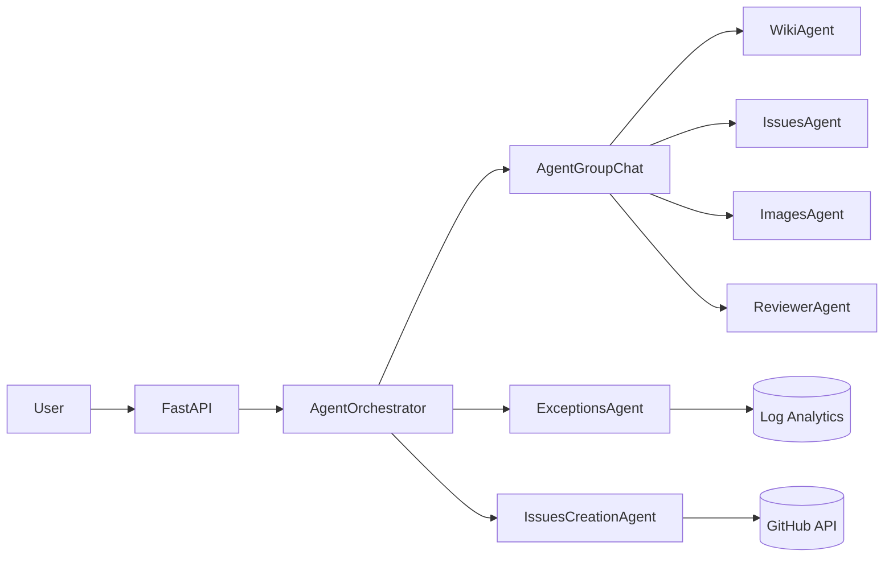
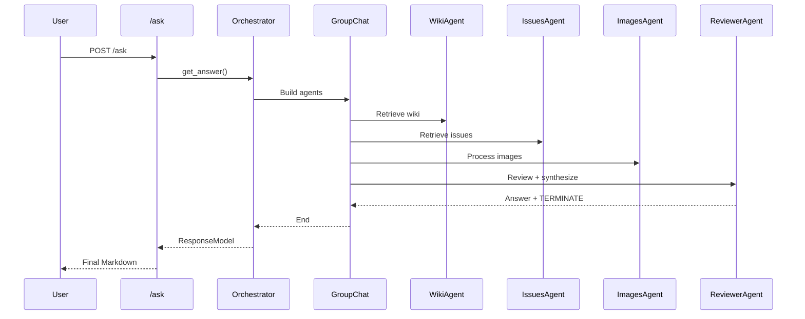
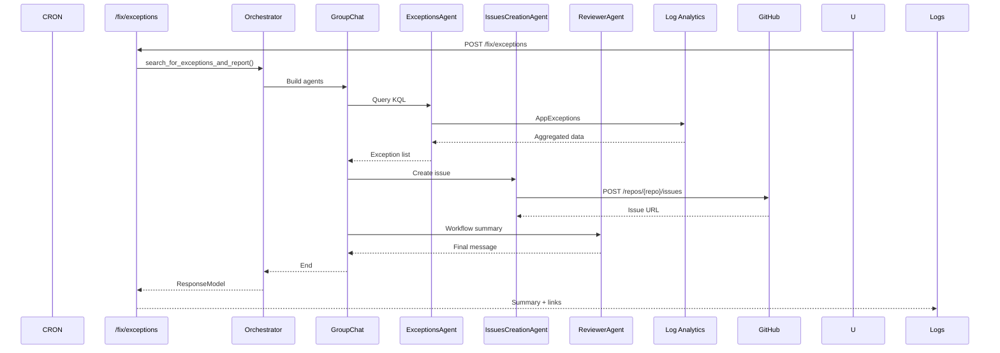

# veta-agents

Agentic bot for GitHub support and automated issue management. Provides a REST API (FastAPI) that coordinates multiple Semantic Kernel agents to answer contextual questions and create issues from detected exceptions.

## Table of Contents
1. [Architecture Overview](#architecture-overview)
2. [Installation](#installation)
3. [Environment Variables](#environment-variables)
4. [Usage](#usage)
5. [Use Cases](#use-cases)
6. [Testing](#testing)
7. [Detailed Docs](#detailed-documentation)

## Architecture Overview


## Installation
```bash
git clone <repo-url>
cd veta-agents
pip install uv
uv sync
```
Activate environment:
```bash
source .venv/bin/activate  # Windows: .venv\Scripts\activate
```

## Environment Variables
See details in `docs/configuration.md`. Minimal example:
```env
ENVIRONMENT=dev
GH_TOKEN=ghp_XXXX
API_KEYS=local-api-key
IMAGES_DEPLOYMENT_NAME=images-depl
IMAGES_API_KEY=xxx
IMAGES_BASE_URL=https://YOUR.openai.azure.com/
IMAGES_API_VERSION=2024-06-01
ISSUES_DEPLOYMENT_NAME=issues-depl
ISSUES_API_KEY=xxx
ISSUES_BASE_URL=https://YOUR.openai.azure.com/
ISSUES_API_VERSION=2024-06-01
WIKIS_DEPLOYMENT_NAME=wikis-depl
WIKIS_API_KEY=xxx
WIKIS_BASE_URL=https://YOUR.openai.azure.com/
WIKIS_API_VERSION=2024-06-01
REVIEWER_DEPLOYMENT_NAME=reviewer-depl
REVIEWER_API_KEY=xxx
REVIEWER_BASE_URL=https://YOUR.openai.azure.com/
REVIEWER_API_VERSION=2024-06-01
```

## Usage
Start server:
```bash
uvicorn app.main:app --reload --env-file .env
```
Swagger: http://localhost:8000/docs
OpenAPI JSON: http://localhost:8000/openapi.json

### Example /ask
```json
{
  "question": "How do I automatically create an issue?",
  "githubWikis": ["https://raw.githubusercontent.com/ORG/REPO/wiki/automation.md"],
  "githubWikiBaseImageUrl": "https://raw.githubusercontent.com/ORG/REPO/wiki/images",
  "githubRepo": "ORG/REPO"
}
```

### Example /fix/exceptions
```json
{
  "azureLogAnalyticsWorkspaceId": "GUID",
  "azureClientId": "APP_ID",
  "azureTenantId": "TENANT_ID",
  "azureClientSecret": "SECRET",
  "days": 1,
  "githubRepo": "ORG/REPO"
}
```

## Use Cases
### Question Flow (`/ask`)


### Exception Flow (`/fix/exceptions`)


## Testing
```bash
pytest -q
```

## Detailed Documentation
See folder [`docs/`](docs/index.md): architecture, models, configuration and extended use cases.

## Requirements
- Python 3.12.10
- FastAPI, Semantic Kernel
- Azure access (Log Analytics + Identity) for exception flow
- GitHub token with scopes `repo` / `public_repo`

## Authors
Developed by Jordi, David and Jose.

## License
Pending.


