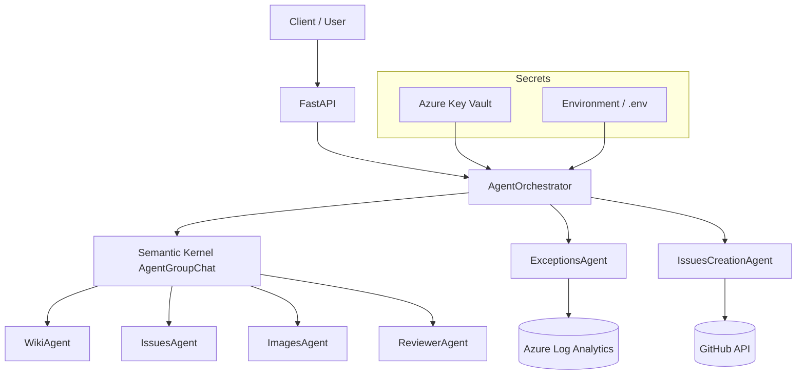

# Architecture

The application uses an **agent-oriented architecture** powered by [Semantic Kernel](https://learn.microsoft.com/en-us/semantic-kernel/) and exposes a REST frontend via [FastAPI](https://fastapi.tiangolo.com/).

## System Overview

```
┌─────────────────────────────────────────────────────────────────────┐
│                        FastAPI  (app/main.py)                       │
│              InsightsMiddleware  ·  X-API-Key auth                   │
├──────────────┬──────────────────────────────────────────────────────┤
│  POST /ask   │  POST /fix/exceptions                                │
└──────┬───────┴──────────┬───────────────────────────────────────────┘
       │                  │
       ▼                  ▼
┌──────────────────────────────────────────────────────────────┐
│                   AgentOrchestrator                           │
│         (AgentGroupChat + ApprovalTerminationStrategy)        │
├──────────────────────────────────────────────────────────────┤
│                                                              │
│  ┌────────────┐ ┌────────────┐ ┌────────────┐               │
│  │ WikiAgent  │ │IssuesAgent │ │ImagesAgent │  ← /ask flow  │
│  └────────────┘ └────────────┘ └────────────┘               │
│                                                              │
│  ┌────────────────┐ ┌──────────────────────┐                 │
│  │ExceptionsAgent │ │IssuesCreationAgent   │  ← /fix flow   │
│  └───────┬────────┘ └──────────┬───────────┘                 │
│          │                     │                             │
│          ▼                     ▼                             │
│   Azure Log Analytics     GitHub API                         │
│   (KQL: AppExceptions)    (create issue → assign Copilot)    │
│                                                              │
│  ┌───────────────┐                                           │
│  │ ReviewerAgent │  ← both flows (sends TERMINATE)           │
│  └───────────────┘                                           │
└──────────────────────────────────────────────────────────────┘
       │                           │
       ▼                           ▼
  Azure OpenAI              Secrets (env / Key Vault)
  (AzureChatCompletion)     via config_factory
```

## Main Components

### FastAPI Layer

- **`app/main.py`** — Creates the FastAPI application, attaches `InsightsMiddleware`, and includes the router with `X-API-Key` dependency.
- **`app/routes.py`** — Defines `POST /ask` and `POST /fix/exceptions` route handlers.
- **`app/auth.py`** — Validates the `X-API-Key` header against comma-separated values in `API_KEYS`.
- **`app/models.py`** — Pydantic models: `RequestModel`, `ExceptionWatchRequestModel`, `ResponseModel`, `HistoryMessageModel`.

### Agent Layer (6 Agents)

Each agent follows the same pattern: a class with `build_agent()` that creates a Semantic Kernel `ChatCompletionAgent` with an `AzureChatCompletion` service and optional plugins.

| Agent | Module | Plugin | External Dependency |
|-------|--------|--------|---------------------|
| **WikiAgent** | `app/agents/wikis/` | `WikiPlugin` — downloads wiki page content and images | HTTP (raw wiki URLs) |
| **IssuesAgent** | `app/agents/issues/` | `IssuesPlugin` — searches GitHub issues via API | GitHub API |
| **ImagesAgent** | `app/agents/images/` | `ImagesPlugin` — downloads images and converts to base64 descriptions | HTTP (image URLs) |
| **ReviewerAgent** | `app/agents/reviewer_agent.py` | None (LLM-only) | — |
| **ExceptionsAgent** | `app/agents/exceptions/` | `ExceptionPlugin` — queries Log Analytics via KQL | Azure Log Analytics |
| **IssuesCreationAgent** | `app/agents/issues_creation/` | `IssuesCreationPlugin` — creates GitHub issues | GitHub API |

### Orchestration Layer

- **`app/services/agent_orchestrator.py`** — Contains `get_answer()` and `search_for_exceptions_and_report()`. Each function:
  1. Instantiates the relevant agents.
  2. Creates an `AgentGroupChat` with the agents and an `ApprovalTerminationStrategy`.
  3. Adds the user message and iterates until termination.
  4. Collects token usage via `TokenConsumptionManager`.
- **`ApprovalTerminationStrategy`** — Stops the conversation when the last message contains `TERMINATE`. Only `ReviewerAgent` is designated as the terminating agent. Maximum iterations: **10**.

### Configuration & Secrets

- **`app/core/config_factory.py`** — Singleton factory: returns cached `Config` (thread-safe).
- **`app/core/config.py`** — `Config` class: validates required secrets and exposes them as attributes.
- **`app/core/env_secret_loader.py`** — Loads from `os.getenv()` (used when `ENVIRONMENT=dev`).
- **`app/core/keyvault_secret_loader.py`** — Loads from Azure Key Vault via `DefaultAzureCredential` (used in production).

## Component Diagram (Mermaid)



## Configuration Flow

1. `get_config()` checks the `ENVIRONMENT` variable.
2. If `dev` → `EnvSecretLoader` reads from environment / `.env` file.
3. Otherwise → `KeyVaultSecretLoader` reads from Azure Key Vault (requires `KEYVAULT_NAME`).
4. `Config._validate_secrets()` verifies all 17 required secrets are present; raises `OSError` if any are missing.
5. Agents inject `deployment_name`, `api_key`, `endpoint`, and `api_version` into SK's `AzureChatCompletion`.

## Termination Strategy

`ApprovalTerminationStrategy` inherits from SK's `TerminationStrategy` and stops when the last message from `ReviewerAgent` contains `TERMINATE`. The keyword is stripped from the final answer before returning to the user.

```python
class ApprovalTerminationStrategy(TerminationStrategy):
    async def should_agent_terminate(self, agent, history):
        return "TERMINATE" in history[-1].content
```

## Key Bug Fixes

### 1. `base_url` → `endpoint` in `AzureChatCompletion`

**Problem:** All agents originally used `base_url=` to pass the Azure OpenAI endpoint URL to Semantic Kernel's `AzureChatCompletion`. This caused **404 errors** because `base_url` sends requests to the URL as-is, bypassing the automatic URL construction.

**Fix:** Changed to `endpoint=` in every agent's `build_agent()` method. The `endpoint` parameter takes the bare Azure OpenAI resource URL (e.g., `https://my-resource.openai.azure.com/`) and correctly builds the full path:

```
/openai/deployments/{deployment_name}/chat/completions?api-version={version}
```

**Files changed:** `reviewer_agent.py`, `wiki_agent.py`, `issues_agent.py`, `images_agent.py`, `exception_agent.py`, `issues_creation_agent.py`

### 2. `InsightsMiddleware` — JSON parse guard

**Problem:** The middleware called `await req.json()` on every request, including `GET` requests to `/docs` and `/openapi.json`. GET requests have no JSON body, causing `JSONDecodeError` crashes when Azure health probes or browsers hit the app.

**Fix:** Added a method check — only parse the body for `POST`, `PUT`, and `PATCH` requests:

```python
if req.method in ("POST", "PUT", "PATCH"):
    try:
        reqbody = await req.json()
    except Exception:
        reqbody = ""
```

**File changed:** `app/core/insightsmiddleware.py`

## Infrastructure Architecture

Infrastructure is defined in `iac/TF/` using **Azure Verified Modules (AVM)**:

```
┌─────────────────────────────────────────────────────────┐
│                 Resource Group (rsg-ghbot-XXX)           │
├─────────────────────────────────────────────────────────┤
│                                                         │
│  ┌──────────────┐  ┌───────────────┐  ┌──────────────┐ │
│  │ App Service   │  │ Container     │  │ Key Vault    │ │
│  │ Plan (Linux)  │  │ Registry      │  │ (RBAC mode)  │ │
│  └──────┬───────┘  └───────────────┘  └──────────────┘ │
│         │                                               │
│  ┌──────┴───────┐  ┌───────────────┐  ┌──────────────┐ │
│  │ Web App for  │  │ Azure OpenAI  │  │ Storage      │ │
│  │ Containers   │  │ (GPT-4o +     │  │ Account      │ │
│  │ (MI enabled) │  │  embeddings)  │  │              │ │
│  └──────────────┘  └───────────────┘  └──────────────┘ │
│                                                         │
│  ┌──────────────┐  ┌───────────────┐                    │
│  │ Log Analytics│  │ App Insights  │                    │
│  │ Workspace    │◄─┤ (OpenTelemetry│                    │
│  └──────────────┘  └───────────────┘                    │
└─────────────────────────────────────────────────────────┘
```

See [`iac/TF/README.md`](../iac/TF/README.md) for full Terraform documentation.
