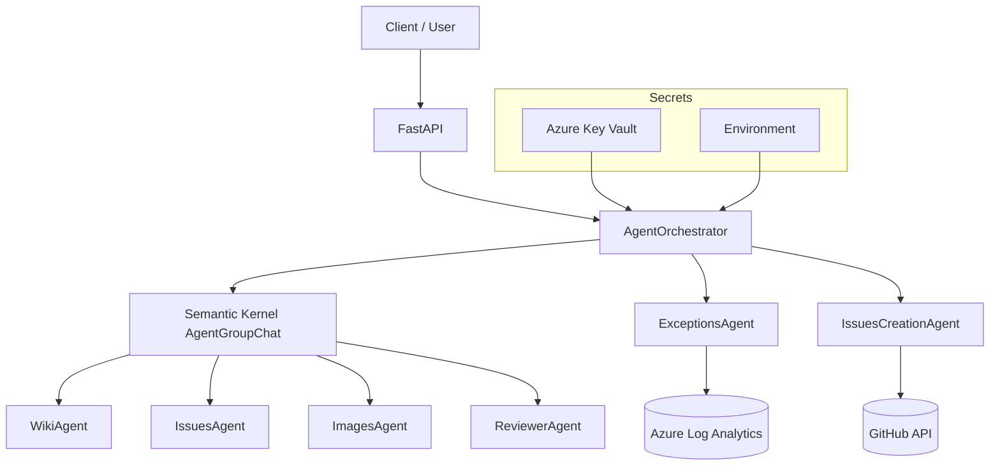

# Architecture

The application uses an agent-oriented architecture powered by Semantic Kernel and exposes a REST frontend via FastAPI.

## Main Components
- FastAPI: Exposes endpoints `/ask` and `/fix/exceptions`.
- `AgentOrchestrator` (`agent_orchestrator.py`): Builds and executes the `AgentGroupChat` with termination strategy.
- Agents:
  - `WikiAgent`: Retrieves wiki page content (including images) for context.
  - `IssuesAgent`: Searches for existing related GitHub issues.
  - `ImagesAgent`: Provides image context or generation (depending on configuration).
  - `ReviewerAgent`: Synthesizes and formats the final response (`TERMINATE` marks the end of the conversation loop).
  - `ExceptionsAgent`: Queries aggregated exceptions from Azure Log Analytics.
  - `IssuesCreationAgent`: Creates new GitHub issues when exceptions are actionable and not already tracked.
- Configuration / Secrets: Loaded via `EnvSecretLoader` (dev) or `KeyVaultSecretLoader` (prod).

## Component Diagram

## Configuration Flow
1. `get_config()` detects `ENVIRONMENT`.
2. Loads secrets (env or KeyVault) and validates required ones.
3. Agents inject deployment names, API keys and base URLs for Azure OpenAI / SK connectors.

## Termination Strategy
`ApprovalTerminationStrategy` stops when the last message from `ReviewerAgent` contains `TERMINATE`; that keyword is stripped from the final answer.
