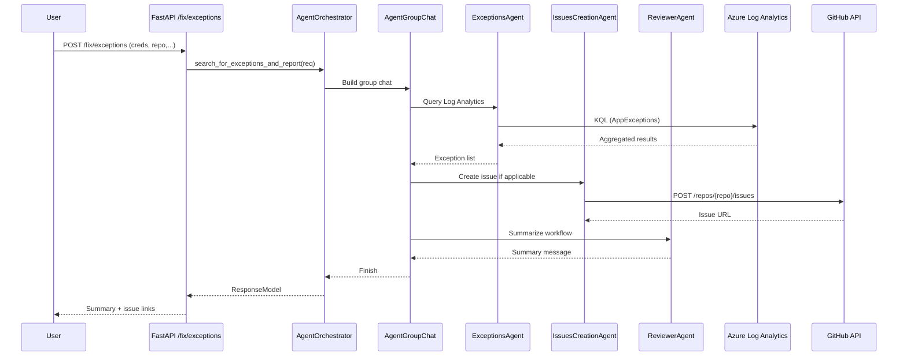

# Use Cases

## 1. Q&A (`POST /ask`)
Goal: The user asks a question and the system composes an answer using context from wikis, issues and images.

### Sequence
```mermaid
sequenceDiagram
  participant U as User
  participant API as FastAPI /ask
  participant ORC as AgentOrchestrator
  participant GC as AgentGroupChat
  participant W as WikiAgent
  participant IS as IssuesAgent
  participant IMG as ImagesAgent
  participant R as ReviewerAgent
  U->>API: POST /ask (question,...)
  API->>ORC: get_answer(request)
  ORC->>GC: Build group chat
  GC->>W: Fetch wiki content
  GC->>IS: Search related issues
  GC->>IMG: Process image context
  GC->>R: Review and synthesize
  R-->>GC: Message with TERMI&shy;NATE
  GC-->>ORC: Iteration finished
  ORC-->>API: ResponseModel
  API-->>U: Structured Markdown
```

### Result
- Markdown formatted answer with sections: Response, Wiki References, Issues Related.
- Aggregated prompt/completion tokens.

## 2. Exception Detection & Issue Creation (`POST /fix/exceptions`)
Goal: Locate recent exceptions and report them by creating GitHub issues.

### Sequence


### Logic
1. If actionable exceptions exist a description is built.
2. An issue is created and assigned (copilot bot if available or a specified user).
3. ReviewerAgent synthesizes the workflow.

## 3. Extensibility
- Add specialized agents (e.g. `SecurityAgent`).
- Replace termination strategy (max iterations, semantic heuristics, etc.).
