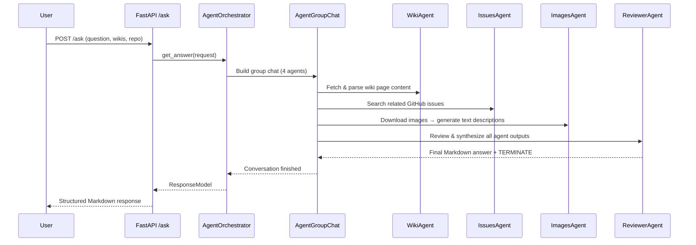
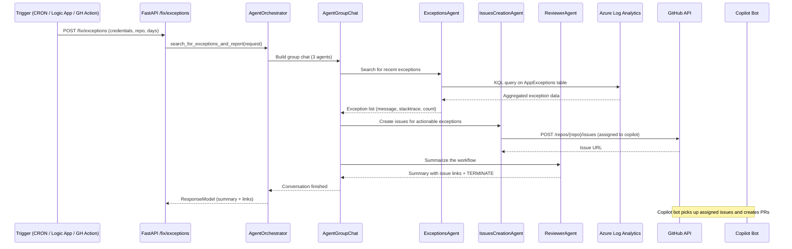

# Use Cases

## 1. Q&A (`POST /ask`)

**Goal:** The user asks a question and the system composes an answer using context from wikis, GitHub issues, and images.

**Agents involved:** WikiAgent, IssuesAgent, ImagesAgent, ReviewerAgent

### Sequence



### Step-by-step

1. The user sends a `POST /ask` with a question, wiki URLs, an image base URL, and a target repo.
2. **WikiAgent** downloads each wiki page, extracts content (including image references), and returns structured JSON with URL + content pairs.
3. **IssuesAgent** searches the target repo's GitHub issues for related questions/resolutions and returns URL + title pairs.
4. **ImagesAgent** downloads images found in the wiki content, converts them to base64, and generates text descriptions to add context.
5. **ReviewerAgent** synthesizes everything into a formatted Markdown answer with three sections:
   - **Response** — direct answer to the question, using images if available
   - **Wiki References** — links to the wiki pages used
   - **Issues Related** — links to related GitHub issues
6. ReviewerAgent appends `TERMINATE` to signal the end of the conversation loop. The keyword is stripped before returning to the user.

### Result

- Markdown-formatted answer with contextual references.
- Full agent conversation log in `agentsGroupChat`.
- Aggregated `prompt_tokens` and `completion_tokens` for cost tracking.

---

## 2. Exception Detection & Issue Creation (`POST /fix/exceptions`)

**Goal:** Detect recent production exceptions from Azure Log Analytics, create GitHub issues for actionable ones, and assign them to Copilot for autonomous PR creation.

**Agents involved:** ExceptionsAgent, IssuesCreationAgent, ReviewerAgent

### Sequence



### Step-by-step

1. An external trigger (CRON job, Azure Logic App, GitHub Action, or manual call) sends `POST /fix/exceptions` with Azure credentials, a target repo, and a lookback window.
2. **ExceptionsAgent** queries the Azure Log Analytics `AppExceptions` table using KQL, filtering for the specified time window. Returns a structured list: `{ message, stacktrace, count }`.
3. **IssuesCreationAgent** evaluates each exception:
   - If actionable (a code error that can be fixed via a PR), it creates a GitHub issue with the exception details.
   - The issue is assigned to the **Copilot coding agent** (or a specified user).
   - If an issue already exists for the same exception, it skips creation.
4. **ReviewerAgent** synthesizes a summary of the workflow: how many exceptions were found, how many issues were created, and links to each issue.
5. **Copilot bot** autonomously picks up the assigned issues and creates pull requests to fix the underlying code.

### Logic Detail

| Condition | Action |
|-----------|--------|
| Actionable exception found, no existing issue | Create issue → assign to Copilot |
| Actionable exception found, issue already exists | Skip (report as already tracked) |
| Non-actionable exception (e.g., transient network error) | Skip (not worth a PR) |
| No exceptions found | Report clean status |

### Triggering Automatically

You can schedule this endpoint with:

- **Azure Logic App** — HTTP trigger on a schedule
- **GitHub Actions** — Scheduled workflow with `cron`
- **CRON job** — Any external scheduler that can call HTTP

Example GitHub Actions trigger:

```yaml
on:
  schedule:
    - cron: '0 8 * * 1-5'  # Every weekday at 8:00 UTC

jobs:
  check-exceptions:
    runs-on: ubuntu-latest
    steps:
      - name: Call /fix/exceptions
        run: |
          curl -X POST https://app-ghbot-854.azurewebsites.net/fix/exceptions \
            -H "Content-Type: application/json" \
            -H "X-API-Key: ${{ secrets.VETA_API_KEY }}" \
            -d '{
              "azureLogAnalyticsWorkspaceId": "${{ secrets.LA_WORKSPACE_ID }}",
              "azureClientId": "${{ secrets.AZURE_CLIENT_ID }}",
              "azureTenantId": "${{ secrets.AZURE_TENANT_ID }}",
              "azureClientSecret": "${{ secrets.AZURE_CLIENT_SECRET }}",
              "days": 1,
              "githubRepo": "${{ github.repository }}"
            }'
```

---

## 3. Extensibility

The architecture is designed for easy extension:

### Adding a New Agent

1. Create a new folder under `app/agents/` (e.g., `app/agents/security/`).
2. Implement three files following the existing pattern:
   - `security_agent.py` — Agent class with `build_agent()` method
   - `security_plugin.py` — SK plugin with tool functions (decorated with `@kernel_function`)
   - `security_accessor.py` — Data access layer (API calls, DB queries, etc.)
3. Add the agent to the relevant `AgentGroupChat` in `agent_orchestrator.py`.
4. Update `ReviewerAgent`'s instructions to account for the new agent's output.

### Changing the Termination Strategy

The default `ApprovalTerminationStrategy` stops when ReviewerAgent says `TERMINATE`. Alternatives:

- **Max iterations only** — remove the keyword check, rely on `maximum_iterations=10`
- **Semantic heuristics** — use the LLM to decide when the answer is complete
- **Voting** — require multiple agents to agree on termination

### Customizing Agent Instructions

Each agent's prompt is defined in its class `__init__` method (or passed as a parameter for ReviewerAgent). Modify instructions to change agent behavior without touching the orchestration logic.
